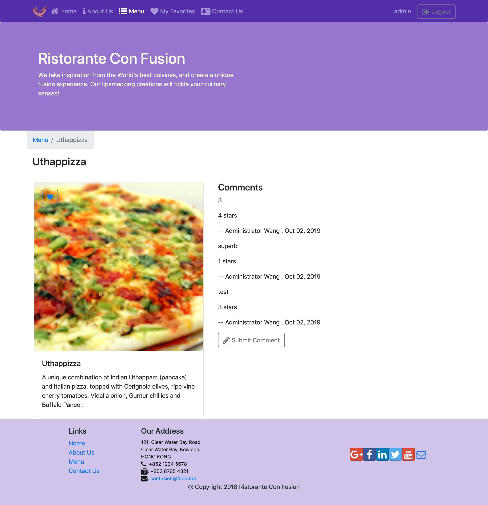

# Ristorante

## Introduction

This is a web application for an italian restaurant. People can browser their favorite dishes and leave comments. Moreover, they are able to save their favorite dishes in their bucket list and send some feedbacks to the restaurant. More information please visit: .

## Description

As you can see the two folders in the repository, one is front-end files which is implemented by React and redux, another one is back-end server folder which includes all files in using nodeJs and mongoDB.

## Screenshots

